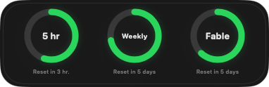

# Claude Usage Tracker

A lightweight macOS desktop tile that shows your remaining Claude capacity at a glance. It sits just above the wallpaper and tracks the 5-hour, weekly all-models, and model-specific limits.




## Features

- Shows remaining capacity for session, weekly, and model-specific usage limits.
- Uses native Liquid Glass on macOS 26 and an adaptive material on macOS 15.
- Keeps the tile behind normal windows and visible across Spaces.
- Refreshes automatically every three minutes while reset countdowns update locally.
- Supports drag-to-position, one-click refresh, and launch at login.
- Builds and installs locally without Xcode project setup or an Apple Developer account.

## Requirements

- macOS 15 or later
- Swift 6.2 or a compatible Xcode toolchain
- Claude Code installed and signed in

## Install

Confirm that Claude Code is signed in:

```sh
claude auth status
```

Clone the repository and run the installer:

```sh
git clone https://github.com/d-esposito/claude-usage-tracker.git
cd claude-usage-tracker
./scripts/install-desktop.sh
```

The installer builds the app locally, applies an ad-hoc signature, installs it to `~/Applications/Claude Usage Tracker.app`, and opens it.

To use a different installation directory, pass it to the script:

```sh
./scripts/install-desktop.sh /Applications
```

## Usage

- Drag anywhere on the tile to reposition it. Its position is remembered.
- Hover a dial to temporarily reveal its exact percentage remaining.
- Right-click the tile to refresh or quit.
- Use the gauge icon in the menu bar to hide/show the tile, refresh it, move it back to the top-right, enable **Launch at Login**, or quit.

## Privacy and implementation

- Reads the existing `Claude Code-credentials` item using Apple's `/usr/bin/security` helper.
- Calls `https://api.anthropic.com/api/oauth/usage` with Claude Code's OAuth token and current CLI version.
- Sends the token only to Anthropic. It is never logged, copied to disk, or included in the usage cache.
- Stores only percentages and reset timestamps in local `UserDefaults` so the last successful reading remains visible during transient failures.
- Uses a borderless AppKit panel at desktop window level, outside WidgetKit and its signing requirements.

> [!IMPORTANT]
> This is an unofficial community project and is not affiliated with or endorsed by Anthropic. It relies on an undocumented personal OAuth usage endpoint that may change or stop working without notice.

## Development

The project is a standard Swift package with no third-party dependencies:

```sh
swift test
swift run ClaudeUsageTrackerDesktop
```
